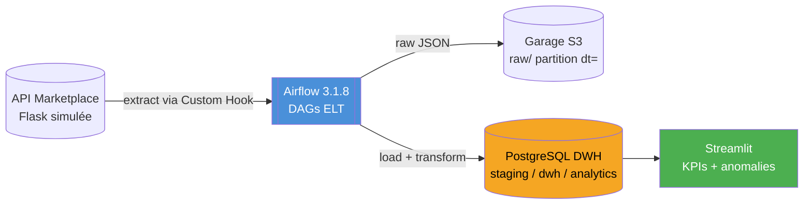
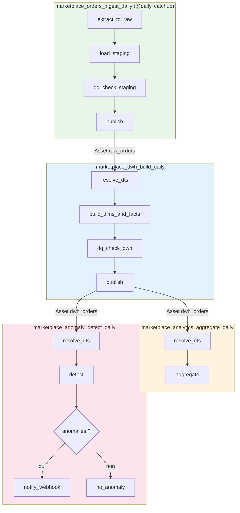
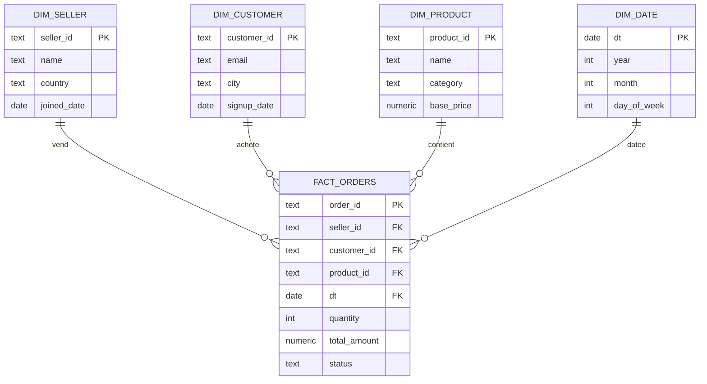

# MarketPlace Analytics — Projet A (option 2)

Pipeline **ELT batch idempotent** pour une marketplace e-commerce :
`API Flask simulée → Garage (S3) → PostgreSQL DWH → Dashboard Streamlit + détection d'anomalies`.

> Conformément à la consigne, **MinIO est remplacé par [Garage](https://garagehq.deuxfleurs.fr/)**
> (stockage objet compatible S3), et le groupe a choisi l'**option 2**
> (Streamlit + détection d'anomalies), pas Metabase.

## Démarrage rapide

```bash
docker compose up -d --build
```

Les DAGs sont dépausés automatiquement : le catchup rejoue l'historique depuis le
`start_date` (2026-07-01), ce qui donne assez de profondeur pour la moyenne mobile 7 jours.

| Service | URL | Rôle |
|---|---|---|
| Airflow 3.1.8 | http://localhost:8080 | Orchestrateur (login désactivé pour le TP) |
| Streamlit | http://localhost:8501 | Dashboard KPIs + anomalies |
| API marketplace | http://localhost:5000 | API Flask simulée (auth Bearer, cf. `.env`) |
| Garage S3 | http://localhost:3920 | Stockage objet, bucket `raw` |
| Garage WebUI | http://localhost:3909 | Interface web pour explorer Garage |
| PostgreSQL DWH | localhost:5434 (`dwh`/`dwh`) | Schémas `staging` / `dwh` / `analytics` |
| PostgreSQL Airflow | localhost:5432 | Metadata DB |

## Architecture globale



## Architecture des DAGs



## Modèle de données (étoile)



## Explorer ce qu'il y a sur Garage

Le plus simple : **Garage WebUI** sur http://localhost:3909 → onglet *Buckets* →
`raw` → *Browse* pour naviguer dans les objets (`orders/dt=2026-07-01/orders.json`, etc.)
et voir leur contenu.

En ligne de commande, deux alternatives :

```bash
# 1. CLI garage intégrée au conteneur
docker compose exec garage /garage bucket list
docker compose exec garage /garage bucket info raw

# 2. AWS CLI depuis l'hôte (clés dans .env, endpoint = port hôte 3920)
aws --endpoint-url http://localhost:3920 --region garage s3 ls s3://raw --recursive
aws --endpoint-url http://localhost:3920 --region garage s3 cp s3://raw/orders/dt=2026-07-01/orders.json -
```

(pour l'AWS CLI : `aws configure` avec `S3_ACCESS_KEY` / `S3_SECRET_KEY` du `.env`)

## Points demandés par le sujet

- **Custom Hook** : [`airflow/dags/lib/marketplace_hook.py`](airflow/dags/lib/marketplace_hook.py)
  — `MarketplaceAPIHook` avec auth Bearer et `get_orders(date)` / `get_sellers()` / `get_products()`.
- **Custom Operator** : [`airflow/dags/lib/data_quality.py`](airflow/dags/lib/data_quality.py)
  — `DataQualityOperator`, 5 règles SQL configurables sur le staging (+ 3 sur le DWH).
- **Idempotence** : pattern `DELETE + INSERT` sur la partition `dt = {{ ds }}` partout,
  dimensions en `INSERT ... ON CONFLICT DO UPDATE`, et l'API génère des données
  **déterministes par date** (seed = date). Relancer 3 fois la même date ⇒ même résultat.
- **Modèle en étoile** : [`sql/init_dwh.sql`](sql/init_dwh.sql) — 4 dimensions + `fact_orders`.
- **Anomalies (option 2)** : CA/vendeur du jour comparé à sa moyenne mobile 7 jours,
  flag si chute > 30 %, écriture dans `analytics.anomalies`, branchement vers un
  webhook simulé si anomalies.

## Tester l'idempotence

Dans l'UI Airflow, "Clear" un run de `marketplace_orders_ingest_daily` (même date)
plusieurs fois, puis :

```bash
docker compose exec postgres-dwh psql -U dwh -c \
  "SELECT dt, COUNT(*), SUM(total_amount) FROM dwh.fact_orders GROUP BY dt ORDER BY dt;"
```

Les compteurs et montants restent identiques à chaque relance.

## Structure du projet

```
├── docker-compose.yml        # 8 services : airflow, 2 postgres, garage (+init +webui), api, streamlit
├── .env                      # secrets du TP (jetons, clés S3, mots de passe)
├── api/                      # API marketplace simulée (Flask, Bearer, webhook)
├── garage/                   # config Garage + script d'init (layout, clé, bucket)
├── sql/init_dwh.sql          # création des schémas staging / dwh / analytics
├── airflow/dags/             # les 4 DAGs
│   └── lib/                  # Custom Hook, Custom Operator, Assets partagés
└── dashboard/                # app Streamlit (option 2)
```

Chaque image custom (`api/`, `dashboard/`) a son propre `requirements.txt`.
